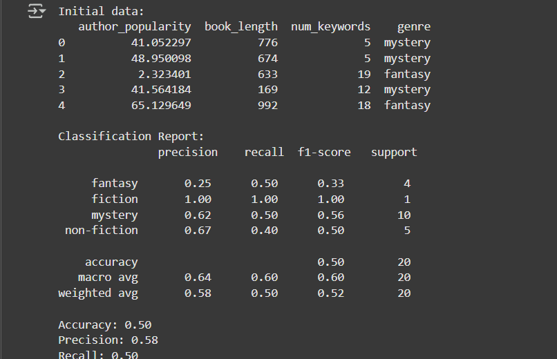

# CLASSIFY_BOOK_GENRES_202401100300032
"A machine learning model to classify book genres using metadata — for Intro to AI MSE"

# 📚 Book Genre Classification using Machine Learning

This project uses a machine learning model to classify books into genres based on metadata such as:
- Author popularity
- Book length
- Number of keywords

## 📁 Dataset
- File: `book_genres.csv`
- Target: `genre`

## ⚙️ Model
- Algorithm: Random Forest Classifier
- Tools: Python, Pandas, Scikit-learn, Seaborn, Matplotlib

## 📊 Evaluation
- Accuracy: ~50%
- Precision: ~57.9%
- Recall: ~50%
- Confusion matrix visualized with heatmap

## 📂 Files Included
- `book_genre_classification.ipynb` – Full notebook with code & output
- `book_genres.csv` – Dataset
- `README.md` – Project summary

## ✅ Author
Aman Upadhyay – AI Mid-Semester Evaluation (MSE-2)

## 📊 Results

### 📈 Initial Data & Classification Report

### 📉 Additional Results
.png)

